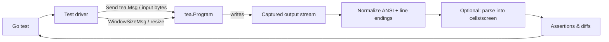
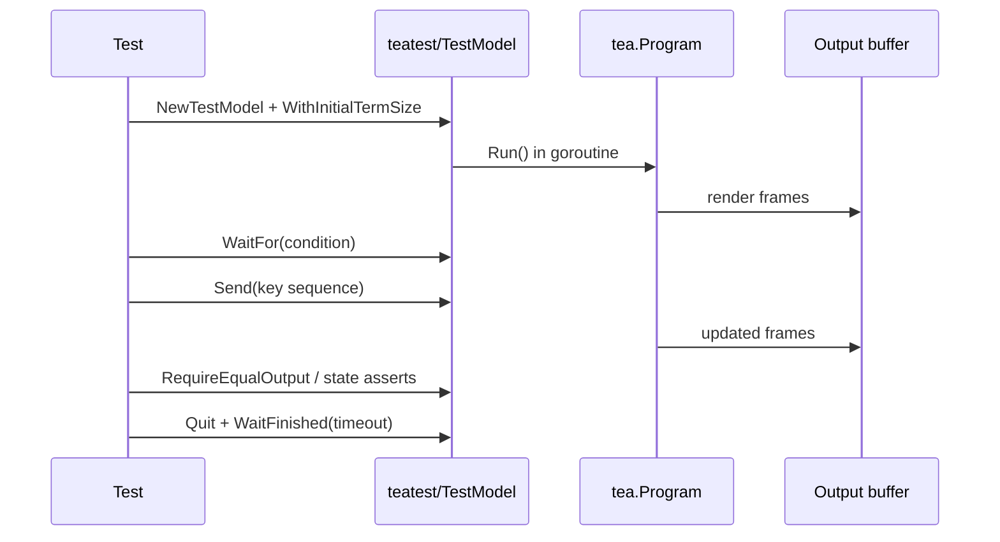

# Reliable Automated Testing for Bubble Tea Terminal UIs in Go

## Executive summary

Bubble Tea TUIs are unusually testable because the core application logic is a pure-ish state machine (Model → Update → View), and the runtime can be configured with mocked input/output and terminal parameters. The most reliable automated strategy is **layered**: test state transitions and component models at unit level, then add a smaller number of program-level “virtual terminal” tests for dialogs, scrolling, and focus/selection flows, and finally (optionally) a few black-box PTY-based end-to-end tests for the real CLI binary. Bubble Tea’s own program options (mock input, capture output, disable renderer, set window size, run with a context) make this feasible without exotic infrastructure. citeturn4view1turn7view1turn7view0

For program-level regression tests, the ecosystem has converged on `teatest` (in the experimental `x/exp` tree) plus golden files: it runs a real `tea.Program`, injects messages, provides `WaitFor`-style synchronization, and supports “snapshot”-style comparisons of rendered output. This pattern is used in real projects (e.g., `fx`), including best practices like pinning terminal size and forcing a deterministic color profile. citeturn8view0turn23view3turn9view0turn18search3turn19search7

When you must validate behavior that depends on *real terminal semantics* (alternate screen, scroll regions, terminal-specific key encodings, or the behavior of subprocesses), PTY-based harnesses (`creack/pty`) combined with an “expect-like” controller (`google/goexpect`, `Netflix/go-expect`) and/or a VT100-style emulator (`vt10x`, `go-ansiterm`, etc.) are the standard approach. This gives you high-fidelity integration coverage, at the cost of more complexity and more opportunities for flakiness. citeturn22search2turn22search4turn2search10turn2search20turn1search0turn1search2turn6search0turn6search3

Determinism is the hardest part of TUI tests. The highest-leverage controls are: fixed window size, fixed color profile, no ambient time/randomness, explicit synchronization (wait for conditions, drain events), and strict timeouts with diagnostic dumps. The current `teatest` implementation itself makes trade-offs here (e.g., consuming output as it waits). Knowing these edge cases and designing your harness around them is key to reliable tests. citeturn8view0turn19search11turn23view3turn19search14turn4view1turn23view0

This report ends with a prioritized, implementable harness blueprint (unit → virtual terminal → PTY E2E), including recommended libraries, trade-offs, CI constraints, and debugging workflows.

## Testing surfaces and architecture

A Bubble Tea app has three distinct “test surfaces,” and reliable suites explicitly choose which surface each test targets:

**Model/state surface (most deterministic):** Drive your model’s `Update` with messages and assert on state. This is where you should test dialog state machines, scroll offsets, selection/focus, pagination state, and command scheduling decisions. Bubble Tea’s architecture makes this straightforward. citeturn4view1turn7view0

**Rendered view surface (medium determinism):** Call `View()` and compare output—preferably after normalizing color/ANSI and relying on stable terminal sizes. Bubble Tea and the testing guide explicitly call out view testing, and also provide knobs to make rendering stable (e.g., fixed window size and fixed color profile). citeturn4view1turn7view1turn3search17turn23view0

**Runtime/terminal surface (highest fidelity, flakiest):** Run a program event loop (in-process, “headless”) or run the compiled CLI in a PTY (black-box), inject keystrokes/resizes, and assert on terminal frames/cells. This is essential when your UI relies on terminal-specific behavior, raw input handling, alternate screen, or complex redraw logic. citeturn8view0turn22search2turn2search10turn1search0

A good mental model is that the terminal is an I/O device and Bubble Tea is a message-driven runtime. Your harness is a “device simulator” that controls: **input bytes/messages**, **window size**, **clock**, and **color/capability environment**, while capturing and analyzing resulting output. citeturn7view1turn4view1turn23view0



### When to prefer each surface

| Target | What you validate well | Typical assertions | Determinism | Cost |
|---|---|---|---|---|
| Model/state | Dialog logic, selection/focus rules, scroll offsets, pagination math, command orchestration | Struct equality, specific fields, invariant checks | High | Low |
| View output | Layout regressions, text/UI composition, “what user sees” snapshots | Golden files, substring checks after normalization | Medium | Medium |
| Runtime/terminal | True key encoding behavior, redraw timing, terminal interactions, subprocess IO | Cell-level screen comparisons, scenario scripts | Lower | High |

This layered split matches the ecosystem’s own guidance: Bubble Tea docs emphasize isolated update/view tests, plus integration tests using I/O mocking; and community practice uses `teatest` for end-to-end-ish view regression while keeping most logic in unit tests. citeturn4view1turn19search7turn18search3turn9view0turn18search17

## Bubble Tea testing APIs and community patterns

### Core runtime knobs for testability

Bubble Tea exposes program options that directly enable test harnesses:

- **`WithInput(io.Reader)` / `WithOutput(io.Writer)`**: inject deterministic input and capture output. citeturn4view1turn7view1turn7view0  
- **`WithWindowSize(w, h)`**: lock initial terminal dimensions to stabilize layout and wrapping. citeturn4view1turn7view1  
- **`WithContext(ctx)`**: enforce timeouts and cancellation from the outside to prevent hung tests. citeturn4view1turn7view1  
- **`WithoutRenderer()`**: disable the renderer when you want simpler output semantics (at the cost of not testing cell-based rendering). citeturn4view1turn7view1  
- **`WithoutSignalHandler()` / `WithoutSignals()`**: avoid signal handling side effects in tests. citeturn7view1turn8view0  
- **`WithColorProfile(profile)`**: force color/ANSI behavior deterministically (e.g., ASCII to eliminate ANSI sequences entirely). citeturn4view1turn7view1  

For interactive testing, two runtime-level APIs are especially important:

- **Key and window messages**: `tea.KeyMsg` and `tea.WindowSizeMsg` are the core “input events” in Bubble Tea. citeturn7view0turn8view0  
- **`(*Program).Send(msg)`**: inject messages into the running program from outside, enabling deterministic keypress/resize simulation without writing to an OS terminal device. The docs note it blocks if the program hasn’t started, and becomes a no-op after termination. citeturn7view0  

### `teatest` and the “virtual terminal” pattern

The ecosystem standard for program-level tests is `teatest` in the experimental `x` repository maintained by entity["organization","Charmbracelet","terminal ui tools company"]. The repository is explicitly described as experimental with no stability guarantees, which matters for long-lived test harness code. citeturn12search1turn16search1

Key capabilities (from docs and source):

- `NewTestModel(tb, model, ...)` starts a real `tea.Program` with in-memory input/output, disables signals, and (notably) enables the ANSI compressor “to reduce drift between runs” in its current implementation. citeturn8view0  
- `WithInitialTermSize(w, h)` sends an initial `tea.WindowSizeMsg` into the running program, stabilizing layout. citeturn8view0turn23view3  
- `WaitFor(tb, reader, condition, ...)` polls output until a condition matches, with defaults (1s duration, 50ms interval) and configurable options. citeturn8view0turn23view3  
- `Send(tea.Msg)` injects messages (commonly `tea.KeyMsg`), and `Type(string)` provides a higher-level “type these runes” helper. citeturn23view3turn19search7  
- `WithFinalTimeout` / `WaitFinished` support bounded teardown. citeturn8view0turn23view3turn9view0  
- `RequireEqualOutput` supports golden-file assertions and explicitly depends on the system `diff` tool, with a `-update` flag to regenerate goldens. citeturn23view3turn18search3  

A widely copied pattern (seen in `fx`) is:

1) Force deterministic styling (`lipgloss.SetColorProfile(termenv.ANSI)`),  
2) Run `teatest.NewTestModel(..., WithInitialTermSize(...))`,  
3) Drive sequences of `tea.KeyMsg`,  
4) Use `WaitFor` to synchronize on output,  
5) Use golden assertions (`RequireEqualOutput`) for regression, and  
6) Always quit and `WaitFinished` with a timeout. citeturn9view0turn3search17turn23view0turn23view3

### Known limitations and sharp edges

Reliable tests require acknowledging `teatest`’s current behavior:

- **Output consumption:** an open issue highlights that using `WaitFor` consumes data from the output reader, making later “final output” checks tricky; it also raises the broader issue that “contains X” doesn’t necessarily mean you’re observing a stable final frame. citeturn19search11turn23view3  
- **Golden files and CRLF:** there has been active work to make golden files stable on Windows and across Git checkouts, including normalizing `\r\n` and/or using `.gitattributes` to preserve `*.golden` files unchanged. citeturn19search14turn18search3turn23view3  

Community discussions on entity["company","GitHub","code hosting platform"] repeatedly point newcomers to `teatest` for simulating user input in list-like UIs. citeturn9view1turn18search3

### Bubble Tea v2 implications

entity["people","Christian Rocha","charmbracelet cofounder"]’s v2 announcement says the next major versions of Bubble Tea/Lip Gloss/Bubbles bring more optimized rendering, more advanced compositing, and higher-fidelity input handling, and that these versions have been used in production (e.g., Crush) before release. citeturn21search23turn18search15

Practically for testing, v2’s higher-fidelity input story can change what a “keypress sequence” means. For example, a v2 discussion notes Bubble Tea v2 will try to enable keyboard enhancements and can deliver a `KeyboardEnhancementsMsg` describing supported features. That means tests that assume specific key ambiguity behavior may need to control (or at least account for) this capability negotiation. citeturn12search17

There is also an explicit community ask for a “tui-test-like” harness; maintainers pointed to `exp/teatest/v2` as an existing (if less robust) answer. citeturn10view0turn20search7

## Headless and virtual terminal approaches

This section surveys the main “headless terminal” approaches used to test TUIs, with emphasis on Bubble Tea but including adjacent ecosystems (tcell/termbox) because they illustrate mature simulation techniques.

### Approach taxonomy

**In-process virtual terminal (Bubble Tea runtime-level):**  
Run your model inside a `tea.Program` configured with in-memory I/O and inject `tea.Msg` directly. This is what `teatest` implements. It is the lightest way to validate program-level interaction while staying inside `go test`. citeturn8view0turn23view3

**PTY-based process harness (OS-level terminal):**  
Create a pseudo-terminal, spawn the real binary, then send bytes as if you were a user at a terminal. This is the standard solution when you need the *actual* terminal I/O behavior, terminfo, and raw mode semantics. The canonical Go library is `creack/pty`, which provides `Start`, `StartWithSize`, and `Setsize` for resize simulation. citeturn22search2turn22search4  
A legacy wrapper `kr/pty` exists but is explicitly deprecated in favor of `creack/pty`. citeturn22search5

**Expect-like controllers (scripted interaction):**  
- `google/goexpect` is frequently combined with a terminal emulator/backing console; it exposes options like `CheckDuration` and `Verbose` for workflow debugging. citeturn6search26turn2search10turn2search20  
- `Netflix/go-expect` provides an expect-like interface over a pseudoterminal for sending input and expecting output, but historical issues discuss OS compatibility constraints; forks such as ActiveState’s `termtest/expect` exist to extend support (notably Windows). citeturn6search3turn6search29turn6search11  

**VT100 / ANSI emulation (buffered screen for assertions):**  
Here you interpret raw ANSI escape sequences into a cell buffer so you can assert on *what the screen looks like* rather than raw bytes. Available Go options include:
- `vt10x` (commonly used with goexpect): `goexpect`’s survey package explicitly recommends `vt10x.NewVT10XConsole` because `os.Stdout` under `go test` is not a TTY. citeturn1search0turn1search2turn2search10  
- `Azure/go-ansiterm`: parses streams of ANSI characters into event handler callbacks; its README points to the VT500 parser state machine and includes tests in `parser_test.go`. citeturn6search0turn5search3  
- `github.com/vito/vt100`: a “programmable ANSI terminal emulator” with explicit limitations (e.g., it warns about bugs and incomplete scrolling/cooked mode). citeturn6search2  

For grounding, VT parsing is traditionally defined via state machines and control sequence specs: vt100.net provides a DEC ANSI parser state machine reference, and xterm control sequences are documented in detail (often tied back to ECMA-48/ISO 6429). citeturn5search3turn5search9turn15search4

**Alternative TUI frameworks with built-in simulations (useful reference):**  
- `tcell` includes a `SimulationScreen`, which is a model for how to design deterministic “cell buffer” tests when the library exposes a screen abstraction. citeturn2search3turn2search4  
- `termbox-go` is still referenced, but its own package page notes it is “somewhat not maintained anymore,” and community guidance often favors tcell. citeturn5search7turn5search0turn5search20  

**TTY-focused helpers:**  
`mattn/go-tty` is a small wrapper for reading from a tty device, with examples and a note about Windows ANSI output via `go-colorable`. It’s more relevant for implementing TUIs than for testing, but it can be useful in specialized harnesses that require direct device semantics. citeturn23view1

### Library/tool comparison table

| Category | Tool/library | Strengths | Weaknesses | Best fit for Bubble Tea |
|---|---|---|---|---|
| In-process harness | `x/exp/teatest` | Runs a real `tea.Program`; message injection; `WaitFor`; golden files; fixed term size; explicit teardown timeouts citeturn8view0turn23view3turn18search3 | Experimental API; output-reader consumption makes some “final state” assertions awkward; golden + platform line endings need care citeturn19search11turn19search14turn12search1 | Primary choice for dialog/scroll/focus flows as regression tests |
| Golden diff helper | `x/exp/golden` | Escapes control codes before comparing; supports `-update`; designed for output with ANSI/control codes citeturn18search16turn19search14 | You still must stabilize rendering/capabilities; platform line ending differences remain a concern without policy citeturn19search14turn18search3 | Use beneath custom assertions; use even when not using full teatest snapshots |
| PTY | `creack/pty` | Canonical PTY spawn; explicit resize (`StartWithSize`, `Setsize`); good for black-box CLI tests citeturn22search2turn22search4 | More moving parts; harder synchronization; OS differences (esp. Windows) | Highest-fidelity integration/E2E tests |
| PTY (deprecated wrapper) | `kr/pty` | Legacy compatibility | Deprecated in favor of `creack/pty` citeturn22search5 | Avoid for new harnesses |
| Expect-like | `google/goexpect` | Expect/send workflows; `Verbose` and configurable polling (`CheckDuration`) citeturn6search26turn2search10 | Often needs a backing console/emulator; regex-driven tests can become brittle | Scenario tests, especially around prompts and subprocess IO |
| Expect-like | `Netflix/go-expect` | “expect-like” interface over a pseudoterminal citeturn6search3turn6search22 | Windows compatibility historically questioned; debugging hangs are a known issue pattern citeturn6search29turn6search7 | Linux/macOS oriented PTY tests; consider fork for Windows |
| VT/ANSI parser | `vt10x` | Practical screen emulation for assertions; recommended because `go test` stdout is not a TTY citeturn1search0turn1search2 | Another component to maintain; terminal semantics completeness varies | Turn ANSI into cells for stable diffs |
| ANSI parser | `Azure/go-ansiterm` | Parses ANSI into handler calls; has tests demonstrating state machine behavior; cross-platform focus citeturn6search0turn6search4 | You must build higher-level “screen” yourself | Useful building block for custom parsers/normalizers |
| Cross-platform E2E suite | `tui-test` from entity["company","Microsoft","technology company"] | Designed as an end-to-end terminal testing framework across macOS/Linux/Windows and various shells; positioned as fast & reliable citeturn12search2turn10view0 | Tests are JS/TS (Node/Bun); integration overhead for Go-only repos citeturn12search2turn10view0 | Best when you want cross-shell black-box guarantees, regardless of implementation language |

## Input simulation and screen assertion techniques

### Sending input sequences and simulating keypresses

There are two fundamentally different ways to “press keys”:

**Message-level injection (preferred for in-process tests):**  
Inject a `tea.KeyMsg` directly. This bypasses terminal encoding details and is deterministic.

- In `teatest`-style tests, `Send(tea.KeyMsg{...})` is the common pattern (see `fx`), including sending runes and special keys (Down, Shift+Left, Enter, etc.). citeturn9view0turn7view0turn23view3  
- Program-level message injection is also possible via `(*tea.Program).Send`, which is documented as safe and no-op after termination. citeturn7view0  

**Byte-level terminal injection (required for black-box PTY tests):**  
Write terminal bytes to the PTY master. This validates your real input reader and terminal negotiation, but adds complexity:

- Use `creack/pty.StartWithSize` to spawn the process attached to a PTY of fixed dimensions, then write bytes (including escape sequences) to the PTY file handle. citeturn22search2turn22search4  
- Use `pty.Setsize` (or `StartWithSize`) to simulate resizes—behavior that matters for responsive layouts and scrolling views. citeturn22search2turn22search4  

### Simulating resize events

At Bubble Tea’s message level, resizes are `tea.WindowSizeMsg` and can be injected like any other message. `teatest.WithInitialTermSize` does exactly this at startup. citeturn8view0turn23view3

At the PTY level, the resize must occur via the PTY handle (so the child process receives SIGWINCH / equivalent). `creack/pty` exposes `Winsize` and `Setsize` for this job. citeturn22search2turn22search4

### Timing and synchronization

Interactive TUIs are asynchronous because commands run outside `Update`. Stable tests replace “sleep and hope” with explicit synchronization:

- `teatest.WaitFor` is the canonical “wait until output matches” primitive, with configurable duration and polling interval. citeturn8view0turn23view3turn9view0  
- `WithContext` at program creation provides a hard upper bound for runaway programs and is recommended by Bubble Tea docs. citeturn4view1turn7view1  
- Expect-like tools provide similar constructs (polling intervals, verbose logging). For example, `goexpect` documents a default 2-second check interval and options to make it more responsive, plus verbose logging to troubleshoot workflows. citeturn6search26turn2search10  

### Capturing output and asserting on “what the terminal shows”

You can assert at three levels, from simplest to most robust:

**Raw bytes:**  
Capture the `io.Writer` output stream and compare it directly. Bubble Tea docs show capturing output to a buffer via `WithOutput`. citeturn4view1turn7view1  
This is simple, but fragile because cursor moves, clears, ANSI compression changes, and terminal capability negotiation can alter control sequences without changing what the user sees.

**Rendered ANSI strings:**  
Normalize the output and compare strings or golden files. The `golden` helper is designed for outputs that include control codes and escape sequences (it escapes them before comparing). citeturn18search16turn19search14  
`teatest.RequireEqualOutput` is a high-level version of this approach, but it uses the system `diff` tool and depends on disciplined golden file management. citeturn23view3turn18search3

**Parsed cell buffer (“screen semantics”):**  
Interpret ANSI sequences into a grid of cells and compare the grid. This is usually the most robust against harmless changes in escape sequences. The Go ecosystem commonly uses vt100/ANSI emulators such as `vt10x` in conjunction with testing harnesses, and `goexpect`’s survey package explicitly recommends vt10x when `go test`’s stdout is not a TTY. citeturn1search0turn1search2turn2search10  
If you build your own parser layer, `go-ansiterm` is a well-documented reference design: it parses streams into handler calls, ties back to the VT500 parser, and includes tests for the parser state machine. citeturn6search0turn5search3turn6search4

### Robust diff strategies that reduce churn

In practice, reliable TUI diffs usually apply three stabilizations:

1. **Fix the rendering envelope** (window size, color profile, capability env). Bubble Tea supports window sizing and color profile forcing; termenv supports deterministic profile selection and respects `NO_COLOR` / `CLICOLOR_FORCE`. citeturn4view1turn7view1turn23view0turn3search17  
2. **Normalize platform behavior** (CRLF/LF, tab width assumptions, etc.). The ecosystem has repeatedly hit CRLF-related golden issues and recommends explicit policies like `.gitattributes` for `*.golden`. citeturn19search14turn18search3  
3. **Compare “meaningful” representations** (cells/lines) rather than raw streams where possible—particularly for scrolling regions and cursor moves that are semantically irrelevant to the final appearance. The maintainer commentary explicitly highlights the value of a VT-based approach for capturing terminal content and sending input events for integrated tests. citeturn21search10  

## Component-specific test patterns with Go snippets

The snippets below are designed to be minimal and emphasize **deterministic** patterns: fixed sizes, explicit waits, bounded teardown, and state-centric assertions. APIs are shown using the `github.com/charmbracelet/bubbletea` import path as documented in stable `teatest` sources; if you’re on Bubble Tea v2 you’ll adapt imports accordingly. citeturn7view0turn18search8turn21search23turn10view0turn20search7

### Dialogs and confirmation flows

**Pattern:** model has a `mode` (normal vs dialog) and dialog-specific selection state; `ctrl+c` transitions into dialog, dialog keys either confirm (quit) or dismiss (return to normal). This is exactly the kind of flow that benefits from `WaitFor` synchronization and then bounded quit. citeturn19search7turn23view3turn7view0

```go
package dialogtest

import (
	"strings"
	"testing"
	"time"

	tea "github.com/charmbracelet/bubbletea"
	"github.com/charmbracelet/x/exp/teatest"
)

type model struct {
	confirmQuit bool
}

func (m model) Init() tea.Cmd { return nil }

func (m model) Update(msg tea.Msg) (tea.Model, tea.Cmd) {
	switch msg := msg.(type) {

	case tea.KeyMsg:
		switch msg.Type {
		case tea.KeyCtrlC:
			m.confirmQuit = true
			return m, nil
		}

		if m.confirmQuit {
			switch msg.String() {
			case "y", "Y":
				return m, tea.Quit
			default:
				// Any other key cancels.
				m.confirmQuit = false
				return m, nil
			}
		}
	}
	return m, nil
}

func (m model) View() string {
	if m.confirmQuit {
		return "Quit? (y/N)\n"
	}
	return "Running.\n"
}

func TestQuitDialog(t *testing.T) {
	tm := teatest.NewTestModel(t, model{}, teatest.WithInitialTermSize(40, 10))

	teatest.WaitFor(t, tm.Output(), func(b []byte) bool {
		return strings.Contains(string(b), "Running.")
	})

	tm.Send(tea.KeyMsg{Type: tea.KeyCtrlC})

	teatest.WaitFor(t, tm.Output(), func(b []byte) bool {
		return strings.Contains(string(b), "Quit? (y/N)")
	})

	tm.Type("y")
	tm.WaitFinished(t, teatest.WithFinalTimeout(1*time.Second))
}
```

This approach mirrors ecosystem guidance and examples showing confirmation dialogs tested via `WaitFor`, message injection, `Type`, and `WaitFinished` with a timeout. citeturn19search7turn23view3turn9view0

### Scrolling views and paginated content

For scrolling components, the most stable tests assert **scroll state invariants**, and only secondarily validate view snapshots.

**Pattern:** represent scroll as `(offset, windowHeight, totalLines)`; test that paging/line scroll respects bounds, and test that the view renders the *correct slice* given a fixed window size.

```go
package scrolltest

import (
	"fmt"
	"strings"
	"testing"

	tea "github.com/charmbracelet/bubbletea"
)

type model struct {
	lines    []string
	offset   int
	height   int
	selected int
}

func newModel(height int, nLines int) model {
	ls := make([]string, nLines)
	for i := range ls {
		ls[i] = fmt.Sprintf("line %03d", i)
	}
	return model{lines: ls, height: height}
}

func (m model) Init() tea.Cmd { return nil }

func (m model) clamp() model {
	maxOffset := len(m.lines) - m.height
	if maxOffset < 0 {
		maxOffset = 0
	}
	if m.offset < 0 {
		m.offset = 0
	}
	if m.offset > maxOffset {
		m.offset = maxOffset
	}
	return m
}

func (m model) Update(msg tea.Msg) (tea.Model, tea.Cmd) {
	switch msg := msg.(type) {
	case tea.KeyMsg:
		switch msg.String() {
		case "down", "j":
			m.offset++
		case "up", "k":
			m.offset--
		case "pgdown":
			m.offset += m.height
		case "pgup":
			m.offset -= m.height
		}
	}
	m = m.clamp()
	return m, nil
}

func (m model) View() string {
	hi := m.offset + m.height
	if hi > len(m.lines) {
		hi = len(m.lines)
	}
	return strings.Join(m.lines[m.offset:hi], "\n") + "\n"
}

func TestScrollBounds(t *testing.T) {
	m := newModel(5, 12)

	// Scroll past end.
	for i := 0; i < 100; i++ {
		nm, _ := m.Update(tea.KeyMsg{Type: tea.KeyDown})
		m = nm.(model)
	}
	if m.offset != 7 { // 12 - 5
		t.Fatalf("offset=%d, want 7", m.offset)
	}

	// Scroll past start.
	for i := 0; i < 100; i++ {
		nm, _ := m.Update(tea.KeyMsg{Type: tea.KeyUp})
		m = nm.(model)
	}
	if m.offset != 0 {
		t.Fatalf("offset=%d, want 0", m.offset)
	}
}
```

This tests the scrolling “physics” deterministically without requiring terminal emulation. When you want UI regression coverage (wrapping, ellipses, scrollbar visuals), promote a small subset of these to `teatest` golden tests and pin terminal size/color profile. citeturn4view1turn7view1turn23view3turn9view0

### Focus and selection across interactive widgets

Focus bugs are often caused by implicit assumptions (“the input is focused”) rather than by rendering. Reliable tests assert the explicit focus state machine.

**Pattern:** a focus index controls which component receives key events; Tab cycles focus; Enter/select acts on the focused component.

```go
package focustest

import (
	"testing"

	tea "github.com/charmbracelet/bubbletea"
)

type model struct {
	focus int // 0=item list, 1=dialog OK, 2=dialog Cancel, etc.
}

func (m model) Init() tea.Cmd { return nil }

func (m model) Update(msg tea.Msg) (tea.Model, tea.Cmd) {
	switch msg := msg.(type) {
	case tea.KeyMsg:
		switch msg.String() {
		case "tab":
			m.focus = (m.focus + 1) % 3
		case "shift+tab":
			m.focus = (m.focus + 2) % 3
		}
	}
	return m, nil
}

func (m model) View() string { return "" }

func TestFocusCycles(t *testing.T) {
	m := model{}

	m2, _ := m.Update(tea.KeyMsg{Type: tea.KeyTab})
	m = m2.(model)
	if m.focus != 1 {
		t.Fatalf("focus=%d, want 1", m.focus)
	}

	m2, _ = m.Update(tea.KeyMsg{Type: tea.KeyTab})
	m = m2.(model)
	if m.focus != 2 {
		t.Fatalf("focus=%d, want 2", m.focus)
	}

	m2, _ = m.Update(tea.KeyMsg{Type: tea.KeyTab})
	m = m2.(model)
	if m.focus != 0 {
		t.Fatalf("focus=%d, want 0", m.focus)
	}
}
```

In production UIs, focus often interacts with terminal focus reporting (Focus/Blur messages). Bubble Tea documents focus messages and program options for enabling focus reporting, which can be important when you test focus-driven behavior. citeturn7view0turn7view1

## Determinism, CI, debugging, and a harness blueprint

### Making tests deterministic and reducing flakiness

**Control the terminal “shape”:**

- Always pin terminal size at startup (`WithWindowSize` or `WithInitialTermSize`). citeturn4view1turn7view1turn23view3  
- Force a stable color profile. Bubble Tea supports `WithColorProfile`; Lip Gloss supports setting a global profile; termenv supports explicit profile selection and `EnvColorProfile` with `NO_COLOR` / `CLICOLOR_FORCE`. citeturn4view1turn7view1turn3search17turn23view0  

**Control time and concurrency:**

- Prefer unit tests that call command functions directly (since commands are `func() Msg`), and inject the resulting messages explicitly, rather than waiting on real time. Bubble Tea’s testing guide explicitly encourages testing update logic and commands in isolation. citeturn4view1turn7view0  
- Use bounded waits and timeouts (`WaitFor` + `WithDuration`, final timeouts, and/or program contexts). citeturn23view3turn8view0turn4view1turn7view1  
- When you must wait for output, prefer “wait for stable condition” (e.g., output contains a marker *and* no longer changes) rather than a single substring. The `teatest` issue about “final terminal state” illustrates why simple “contains X” can be insufficient. citeturn19search11turn23view3  

**Make golden files portable:**

- Adopt `.gitattributes` policies for `*.golden` to prevent line-ending conversions (recommended by the teatest author and echoed in repo issues). citeturn18search3turn19search14  
- Understand your diff tool dependency: `teatest.RequireEqualOutput` uses the system `diff` tool, which may not exist in minimal containers or on Windows. If you need fully self-contained diffs, use `golden` directly and/or ensure your CI environment provides `diff`. citeturn23view3turn18search16turn19search14  

### CI considerations for headless environments

**No real TTY:** A recurring CI problem is that under `go test`, stdout is often not treated like an interactive terminal. The goexpect survey package explicitly notes this and suggests using `vt10x.NewVT10XConsole` for terminal-like behavior in tests. citeturn1search0turn1search2turn2search10

**Windows differences:** Golden files and PTYs behave differently on Windows; the `x` repository has open discussion about CRLF normalization and golden stability. Some expect/PTTY tools have historically been Linux/macOS-first, motivating forks specifically for Windows support. citeturn19search14turn6search29turn6search11turn22search2

**Terminal capability negotiation:** For deterministic output, explicitly set capability-related environment variables when running the program. Bubble Tea exposes `WithEnvironment` to pass a known environment (useful in remote/SSH contexts and equally applicable for tests). citeturn7view1turn23view0

### Debugging techniques for failing TUI tests

Reliable debugging is about turning “flaky terminal spaghetti” into artifacts you can inspect:

- **Record and replay message streams:** dumping messages to a file is a recommended practice for Bubble Tea development; it also enables deterministic reproduction of tricky interaction bugs. citeturn15search12turn12search21  
- **Verbose logging in expect frameworks:** `goexpect`’s `Verbose` option is explicitly positioned as a troubleshooting aid, logging interactions. citeturn6search26  
- **On failure, persist the last frames:** `teatest.WaitFor` returns the last captured output in its timeout error message (“Last output: …”), which can be turned into a failure artifact. citeturn8view0turn23view3  
- **Visual diffs / rendered views:** VT emulators like `jaguilar/vt100` include HTML rendering of the parsed screen state, a useful trick for debugging when ANSI is unreadable. citeturn6search6turn6search14  

### Recommended harness blueprint you can implement

This blueprint prioritizes reliability first and fidelity second, matching the trade-offs surfaced in ecosystem discussions (including maintainers explicitly calling out VT-based integrated tests as a future direction). citeturn21search10turn18search17turn4view1



**Step one: establish a deterministic “test profile.”**  
Create a helper (or `TestMain`) that sets:
- fixed color profile (ASCII if you don’t care about colors, ANSI/256/TrueColor if you do), citeturn4view1turn23view0turn3search17  
- fixed initial window size for all program-level tests, citeturn23view3turn8view0  
- and a global test timeout policy (`WithContext` or per-test final timeouts). citeturn4view1turn7view1turn23view3  

**Step two: treat every interactive component as a state machine and unit test its invariants.**  
For dialogs, verify modal transitions (open, confirm, cancel). For scrolling, verify bounds and offset progression. For lists/pagination, verify selection indices and page calculations. Bubble Tea’s testing guide explicitly endorses isolated update/view/command tests. citeturn4view1turn7view0

**Step three: add a small number of `teatest` scenario tests for “critical flows.”**  
Pick scenarios where regressions are costly or hard to spot manually:
- dialog sequences (quit confirmation, destructive actions),  
- scrolling/pagination in representative window sizes,  
- focus switching between inputs and lists,  
- “errors and empty states” screens.

Use the canonical shape:
- `NewTestModel`,  
- `WaitFor` -> `Send` -> `WaitFor`,  
- snapshot (golden) comparisons for final views,  
- ensure clean exit + bounded `WaitFinished`. citeturn23view3turn9view0turn19search7

**Step four: choose one of two snapshot philosophies and be consistent.**

- **Golden the whole terminal output** (fast regression coverage, more churn). This is what `RequireEqualOutput` and `golden` enable. citeturn23view3turn18search16turn18search3  
- **Golden normalized frames or cell grids** (less churn, more engineering): parse ANSI into cells (vt10x/go-ansiterm) and compare the stable grid; this aligns with maintainer commentary about VT-based integrated testing. citeturn1search0turn6search0turn21search10turn15search4  

**Step five: add PTY-based black-box tests only where justified.**  
Use PTY tests sparingly (1–5 total):
- “Does the binary behave correctly in a real terminal?”
- “Does resizing via SIGWINCH behave?”
- “Do key encodings in real terminals work (including escape sequences)?”
Implement with `creack/pty` and (optionally) an expect tool.

A minimal PTY pattern:

```go
package ptye2e

import (
	"bufio"
	"os/exec"
	"testing"
	"time"

	"github.com/creack/pty"
)

func TestBinaryStartsAndQuits(t *testing.T) {
	cmd := exec.Command("./myapp") // build this in test setup
	ptmx, err := pty.StartWithSize(cmd, &pty.Winsize{Rows: 24, Cols: 80})
	if err != nil {
		t.Fatal(err)
	}
	defer ptmx.Close()

	// Read until a prompt appears (simplified).
	r := bufio.NewReader(ptmx)
	deadline := time.Now().Add(2 * time.Second)

	for {
		if time.Now().After(deadline) {
			t.Fatal("timeout waiting for prompt")
		}
		line, err := r.ReadString('\n')
		if err == nil && len(line) > 0 {
			// Once ready, quit.
			_, _ = ptmx.Write([]byte("q"))
			break
		}
	}

	_ = cmd.Wait()
}
```

The `creack/pty` docs confirm `StartWithSize` and `Winsize`, and the README includes interactive examples (including writing to the PTY and streaming output). citeturn22search2turn22search4

**Step six: build first-class failure artifacts.**  
For every program-level test:
- On timeout, dump the last N bytes of output (teatest already keeps a buffer in `WaitFor`). citeturn8view0turn23view3  
- Provide a “replay mode” that reruns the scenario with verbose logging (goexpect’s verbose option is a good model). citeturn6search26  
- Standardize how you regenerate snapshots (`-update`) and how your repo prevents line-ending drift. citeturn23view3turn19search14turn18search3  

### Recommended tools and trade-offs

- Best default for Bubble Tea program-level tests: `x/exp/teatest` + `x/exp/golden`, with strict terminal sizing and color profile forcing. citeturn23view3turn8view0turn18search16turn9view0  
- Best default for OS-level E2E: `creack/pty` + a VT emulator (`vt10x`) + an expect-like orchestrator. Use this only after you have stable unit + teatest coverage. citeturn22search2turn1search0turn2search10turn6search3  
- For cross-platform, cross-shell black-box guarantees (especially if Windows shells matter), consider `tui-test`, understanding it moves tests into JS/TS. citeturn12search2turn10view0  
- If you’re building a deeper harness: follow maintainer direction toward VT-based integrated tests (the `x/vt` and `x/xpty` direction), i.e., treat the terminal as a simulated device with a cell buffer and event injection. citeturn21search10  
- If you need terminal capability determinism, rely on termenv’s explicit profile selection and environment-variable semantics (`NO_COLOR`, `CLICOLOR_FORCE`) rather than auto-detection. citeturn23view0turn23view2turn7view1  

Finally, keep the suite honest: most behaviors you care about for dialogs, scrolling, pagination, and focus can (and should) be proven at the state-machine level, with a smaller number of program-level snapshots to protect against UI regressions. This aligns with both official docs and real-world community experience, including explicit notes that full event-loop tests are heavier and can be less deterministic when async effects are involved. citeturn4view1turn18search17turn19search7turn23view3
